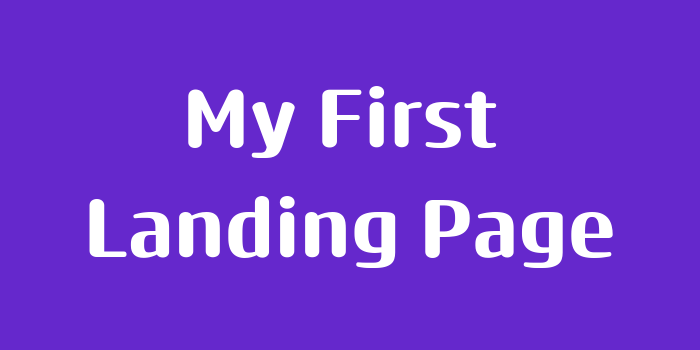

 
 

# Description
This project involved building a basic landing page using HTML and CSS. It is part of the Odin Project curriculum, which is an excellent resource for learning full-stack web development

# Skills i have learnt
- **HTML**
- **CSS**
- **FLEXBOX**

# Completed in:
- **5 Hours 🕓**
- **It's A long peroid I know, But I'm still Learning ☺️**

## Credits
The icons used in this project are provide by [FLATICON](https://www.flaticon.com/?k=1722783672059&log-in=google)

- <a href="https://www.flaticon.com/free-icons/stress" title="stress icons">Stress icons created by juicy_fish - Flaticon</a>
- <a href="https://www.flaticon.com/free-icons/emotional-intelligence" title="emotional intelligence icons">Emotional intelligence icons created by juicy_fish - Flaticon</a>
- <a href="https://www.flaticon.com/free-icons/eye" title="eye icons">Eye icons created by juicy_fish - Flaticon</a>
- <a href="https://www.flaticon.com/free-icons/calm" title="calm icons">Calm icons created by Freepik - Flaticon</a>

